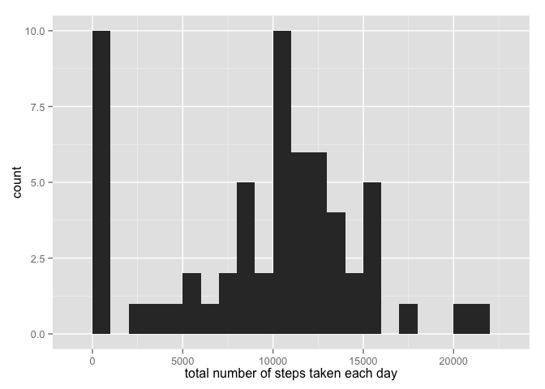

# Reproducible Research: Peer Assessment 1


## Loading and preprocessing the data

```r
library(data.table) #install.packages("data.table") if there is no library data.table
library(lattice)
library(ggplot2)
#The reason I use multiple plot library is I am new to R plotting, so for each plot I just googled how to do it(mostly find the answers in http://stackoverflow.com/). Each of the answer uses different plot library.
data=read.csv(unz('activity.zip','activity.csv'))
data <- data.table(data)
summary(data)
```

```
##      steps                date          interval     
##  Min.   :  0.00   2012-10-01:  288   Min.   :   0.0  
##  1st Qu.:  0.00   2012-10-02:  288   1st Qu.: 588.8  
##  Median :  0.00   2012-10-03:  288   Median :1177.5  
##  Mean   : 37.38   2012-10-04:  288   Mean   :1177.5  
##  3rd Qu.: 12.00   2012-10-05:  288   3rd Qu.:1766.2  
##  Max.   :806.00   2012-10-06:  288   Max.   :2355.0  
##  NA's   :2304     (Other)   :15840
```


## What is mean total number of steps taken per day?
1. Calculate the total number of steps taken per day

```r
step_sum_by_date <- as.data.frame(data[, j=list(steps = sum(steps, na.rm = TRUE)),by = date])#total number of steps taken per day
head(step_sum_by_date) # the whole data is very long so we just take a look at first 6 entry
```

```
##         date steps
## 1 2012-10-01     0
## 2 2012-10-02   126
## 3 2012-10-03 11352
## 4 2012-10-04 12116
## 5 2012-10-05 13294
## 6 2012-10-06 15420
```
2. Make a histogram of the total number of steps taken each day

```r
qplot(step_sum_by_date$steps, binwidth = 1000, xlab = "total number of steps taken each day")
```

 

```r
#there are some days without any step record, here we simplily leave these days here.
```
3. Calculate and report the mean and median of the total number of steps taken per day

```r
mean(step_sum_by_date$steps)#NOTE: days with zero steps are included
```

```
## [1] 9354.23
```

```r
median(step_sum_by_date$steps)
```

```
## [1] 10395
```
## What is the average daily activity pattern?
1. Make a time series plot (i.e. type = "l") of the 5-minute interval (x-axis) and the average number of steps taken, averaged across all days (y-axis)

```r
step_sum_by_int <- as.data.frame(data[, j=list(steps = mean(steps, na.rm = TRUE)),by = interval])
summary(step_sum_by_int)
```

```
##     interval          steps        
##  Min.   :   0.0   Min.   :  0.000  
##  1st Qu.: 588.8   1st Qu.:  2.486  
##  Median :1177.5   Median : 34.113  
##  Mean   :1177.5   Mean   : 37.383  
##  3rd Qu.:1766.2   3rd Qu.: 52.835  
##  Max.   :2355.0   Max.   :206.170
```

```r
plot(step_sum_by_int$interval, step_sum_by_int$steps, type = "l", xlab = "5-min interval", 
    ylab = "Average across all Days", main = "Average number of steps taken")
```

 
2. Which 5-minute interval, on average across all the days in the dataset, contains the maximum number of steps?

```r
step_sum_by_int[which.max(step_sum_by_int$steps),]
```

```
##     interval    steps
## 104      835 206.1698
```
So the largest number of steps is 206.1698 at interval 835.
## Imputing missing values
1. Calculate and report the total number of missing values in the dataset

```r
sum(is.na(data))
```

```
## [1] 2304
```
2. Devise a strategy for filling in all of the missing values in the dataset.
3. Create a new dataset that is equal to the original dataset but with the missing data filled in.
we fill the missing val with average of corresponding interval.

```r
new_data <- data
for (i in 1:nrow(data)){
  if (is.na(data$steps[i])){
    interval_val <- data$interval[i]
    steps_val <- step_sum_by_int$steps[which(step_sum_by_int$interval == interval_val)]
    new_data$steps[i] <- steps_val
  }
}
```
4. Make a histogram of the total number of steps taken each day and Calculate and report the mean and median total number of steps taken per day.

```r
new_step_sum_by_date <- as.data.frame(new_data[, j=list(steps = sum(steps, na.rm = TRUE)),by = date])#total number of steps taken per day
qplot(new_step_sum_by_date$steps, binwidth = 1000, xlab = "total number of steps taken each day with imputated missing value")
```

 

```r
mean(new_step_sum_by_date$steps)#NOTE: now there are no zero records
```

```
## [1] 10766.19
```

```r
median(new_step_sum_by_date$steps)
```

```
## [1] 10766.19
```
The mean increases because the values with zero now become larger than zero after imputation.However we replace the NA value by the mean of their intervals so the overall shape of data does not changed, so the median is the same.

## Are there differences in activity patterns between weekdays and weekends?
1. Create a new factor variable in the dataset with two levels – “weekday” and “weekend” indicating whether a given date is a weekday or weekend day.

```r
new_data$date <- as.Date(new_data$date, "%Y-%m-%d")
day <- weekdays(new_data$date)
daylevel <- vector()
for (i in 1:nrow(new_data)) {
    if (day[i] == "Saturday" | day[i] == "Sunday") {
        daylevel[i] <- "Weekend"
    } else {
        daylevel[i] <- "Weekday"
    }
}
new_data$daylevel <- daylevel
new_data$daylevel <- factor(new_data$daylevel)
table(new_data$daylevel)
```

```
## 
## Weekday Weekend 
##   12960    4608
```
2. Make a panel plot containing a time series plot (i.e. type = "l") of the 5-minute interval (x-axis) and the average number of steps taken, averaged across all weekday days or weekend days (y-axis).

```r
data_byweekday <- aggregate(steps ~ interval + daylevel, data=new_data, FUN="mean")
xyplot(steps ~ interval | daylevel, data=data_byweekday, type="l", grid=T, layout=c(1,2), ylab="Average number of steps taken", xlab="5-min. intervals", main="Average  5-min. activity intervals: Weekdays vs. Weekends")
```

 
